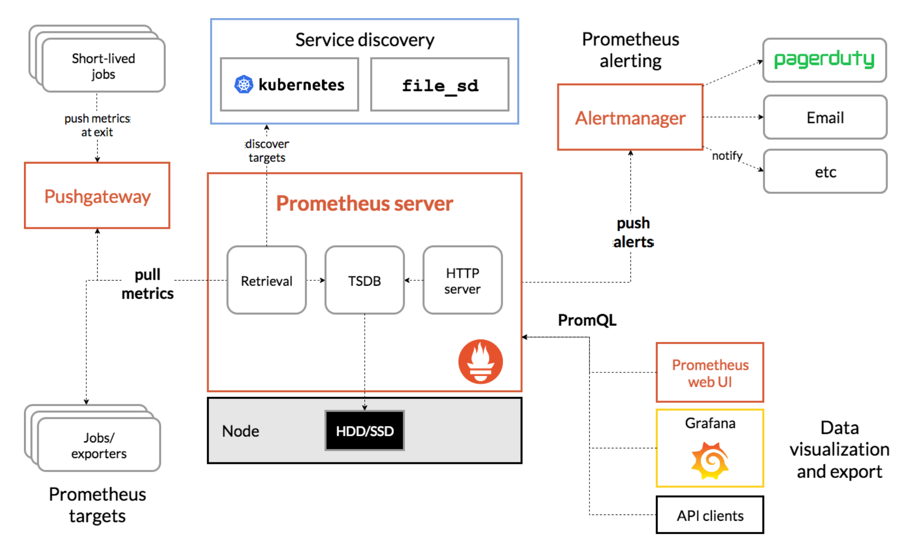

# Prometheus_Grafana
Prometheus &amp; Grafana 학습을 위한 레포지토리


# 학습 목표 및 과제 설명

이전에 작업을 진행했던 오목 게임 서버에 Prometheus와 Grafana를 사용하여

서버와 시스템 상태를 실시간으로 모니터링 합니다.


#### 최소 요구 조건
- 게임 서버가 실행중인 머신의 정보 표시 (ex. cpu, memory 사용량 등)
- 게임 서버의 GC 관련 사용에 대한 정보 표시
- 초당 클라이언트 요청 수 표시

#### 학습 링크 : [프로메테우스&그라파나 학습](http://devgit.com2us.com/central-server/education/dev_guide_monitoring/-/tree/master/prometheus_grafana?ref_type=heads)

-----

Prometheus와 Grafana는 모니터링과 시각화에 많이 사용되는 도구로, 

주로 시스템 성능, 애플리케이션 상태, 서버 상태를 추적하고 분석에 사용한다.

Prometheus는 데이터를 수집하고 저장하는 역할을, Grafana는 Prometheus에서 수집한 데이터를 시각화하는 역할을 한다.

전체 흐름은 다음과 같다. 

Prometheus (모니터링 및 데이터 수집)

- Prometheus는 타겟(서버, 애플리케이션, 데이터베이스)로부터 메트릭을 주기적으로 스크랩(scrape)한다.
- 수집된 메트릭을 시간 시계열 데이터로 저장하고, 이를기반으로 특정 쿼리와 알람을 설정할 수 있다.

Grafana (시각화 및대시보드)

- Grafana는 Prometheus와 같은 데이터 소스로부터 데이터를 받아 시각화한다.
- 사용자는 여러 위젯을 통해 데이터를 분석하고, 대시보드를 구성하여 실시간 모니터링을 할 수 있다


<br>


# Prometheus

프로메테우스는 대상 시스템으로부터 각종 모니터링 지표를 수집하여 저장하고 검색할 수 있는 시스템이다.

SoundCloud에서 만든 ` 오픈소스 모니터링 시스템 ` 및 알림 툴킷

프로메테우스는 metrics(수치 측정치)를 시계열 데이터(time-series data)로 수집하고 저장한다.

즉 metrics 정보는 label이라는 key-value 쌍과 timestamp와 함께 저장된다.

- 메트릭은 시간에 따른 추이를 추적할 가치가 있는 데이터로, 메모리/CPU/스레드 사용률 등이 있다.

<details> 
<summary> 공식 문서 : 주요 기능 </summary>

[Prometheus Inroduction](https://prometheus.io/docs/introduction/overview/)
- 메트릭 이름과 키-값 쌍으로 식별되는 시계열 데이터가 포함된 다차원 데이터 모델
- PromQL이라는 강력한 쿼리 언어
- 분산형 스토리지에 의존하지 않고 단일 서버 노드의 자율적인 운영
- HTTP 풀 모델을 통한 시계열 수집
- ... 등
</details> 

프로메테우스를 활용해서 아래와 같은 일들을 할 수 있다.
- 감시 대상의 서버를 자동으로 탐색 (Serivce Discovery)
- 감시 대상의 서버로부터 측정치(metrics)를 수집/보관
- 보관 중의 데이터에 대해 집계 쿼리를 통해 의미있는 지표 생성
- 상황에 따른 alert 설정/알림


<br>
<br>

## 프로메테우스 아키텍처



Prometheus는 다른 모니터링 시스템과는 달리 Pull 형태로 metric을 수집하는 특징이 있다.

<details>
<summary> Pull 방식이란? </summary>

Prometheus가 **Pull 형태**로 메트릭을 수집한다는 것은, 다른 일부 모니터링 시스템들이 사용하는 **Push 방식**과 대조적이다. 

이 두 방식의 차이점을 이해하면 Prometheus가 어떻게 작동하는지 더 명확하게 파악할 수 있다.

#### Pull 방식 (Prometheus)

- Prometheus 서버는 설정된 간격으로 (예: 15초, 30초 등) 정의된 타겟(노드, 서비스 등)으로부터 직접 메트릭을 가져오기 위해 HTTP 요청을 보낸다.
- 각 타겟은 메트릭을 제공하는 HTTP 엔드포인트(주로 `/metrics` 경로)를 노출해야 하며, 이 엔드포인트에서는 Prometheus가 이해할 수 있는 형식으로 메트릭을 제공한다
  
- **장점**:
  + 구성의 단순성: 모니터링 대상이 되는 시스템이나 서비스에 대한 관리가 상대적으로 간단합니다. 각 타겟은 단지 메트릭을 노출하기만 하면 되며, 모든 수집 로직은 Prometheus 서버 측에서 관리된다
  + 네트워크 불안정성 대처: Prometheus 서버가 타겟에 접근할 수 없는 경우, 해당 스크레이프(scrape) 시도는 실패로 기록되고 다음 간격에서 다시 시도된다. 일시적인 네트워크 문제가 데이터 손실로 직결되지 않는다.
  + 보안: 타겟 시스템이 외부로 데이터를 보내지 않기 때문에, 내부 네트워크에서 관리되는 시스템의 보안을 유지하기가 더 용이하다.

- **단점**:
  + 스케일링 이슈: 매우 큰 시스템에서는 수천 개의 타겟을 주기적으로 스크레이프하는 것이 성능에 영향을 줄 수 있다.
  + 발견 지연: 새로운 서비스나 인스턴스가 추가되었을 때 Prometheus가 이를 인지하고 스크레이프 리스트에 추가하는데 시간이 걸릴 수 있다.

 
#### Push 방식 (다른 시스템 예: InfluxDB, Graphite 등)

- 메트릭 데이터를 생성하는 각 서비스나 애플리케이션은 직접 모니터링 시스템으로 데이터를 전송(push)한다. 
- 이 경우, 각 타겟은 모니터링 시스템의 데이터 수집 엔드포인트로 데이터를 보내는 책임을 진다.

- **장점**:
  + 실시간 데이터 전송: 메트릭이 생성되는 즉시 모니터링 시스템으로 전송되므로, 거의 실시간으로 모니터링이 가능하다.
  + 분산 처리 용이: 데이터를 보내는 책임이 각 타겟에 있기 때문에, 많은 수의 타겟을 관리하는 대규모 환경에서 확장성의 장점을 갖는다.

- **단점**:
  + 네트워크 불안정성: 네트워크 문제로 인해 메트릭 데이터가 유실될 수 있다.
  + 보안 문제: 각 타겟이 외부 모니터링 시스템에 데이터를 직접 보내야 하기 때문에, 보안 설정과 관리가 더 복잡해질 수 있다.


Pull 방식은 특히 구성의 단순성과 내부 네트워크 환경에서의 보안 유지 측면에서 유리하다.

</details>

Prometheus 서버는 주기적으로 감시 대상의 노드에 직접 웹 요청을 보내 metrics를 수집하고, 

다차원 형태의 데이터 모델로 이를 저장한다.

감시 대상의 노드는 정적으로 설정할 수 있고, service discovery를 통해 동적으로 설정할 수도 있다.

감시 대상의 노드에는 exporter라는 컴포넌트를 설치만 하면 서버에 웹 api를 오픈할 수 있기 때문에, Prometheus의 환경 구성이 매우 간단하다.

exporter에는 공개 되어있는 종류가 굉장히 많기 때문에 필요로하는 metric에 따라서 바로 설치가 가능하다.


데이터를 조회할 때는 PromQL이라는 쿼리 언어를 사용하는데, 모니터링 지표의 조회/가공에 특화되어 있다.

얻어낸 지표를 내장된 Web UI로 시각화할 수 있고, Grafana와 연동하여 더 다양한 시각화를 할 수 있다.

사전에 정의한 규칙에 따라 사용자의 메일이나 slack으로 알람을 보내는 기능 또한 존재한다.

<br>
<br>

## 기능

프로메테우스에서는 Service discovery가 존재하는데, 해당 기능을 통해 target으로 등록된 대상의 데이터들을 수집할 수 있다.

prometheus.yml 파일

scrape할 job_name과 static_config를 등록하면 대상의 metric들을 수집할 수 있다.

```yml
scrape_configs:
  # The job name is added as a label `job=<job_name>` to any timeseries scraped from this config.
  - job_name: 'prometheus'
    # metrics_path defaults to '/metrics' & scheme defaults to 'http'.
	static_configs:
	  - targets: ['localhost:9090']

  - job_name: 'node'
	static_configs:
	  - targets: ['localhost:9100']

```

프로메테우스의 장점은 collectd + influxdb + grafana 의 기능을 모두 사용할 수 있다는 점이다.

Service discovery가 collectd의 기능을 하며, 수집된 Metric들은 Prometheus server의 TSDB(Time Series Database, 시계열 DB)에 저장된다.

저장된 데이터를 통해 Prometheus Web UI에서 promql을 통해 시각화한 모습을 볼 수 있고, Grafana를 통해 데이터를 시각화할 수 있다.


또한, Prometheus는 Alertmanager를 통해 알람을 설정할 수 있고, 이를 통해 알람을 받을 수 있다.

아래 부분이 alerting 부분으로, targets의 주소에 알람 매니저의 주소를 등록하면 된다.

rules 위반으로 판단되면 등록된 receiver(알람을 받을 대상)에게 알람을 보낸다.

```yml
alerting:
  alertmanagers:
	- static_configs:
	  - targets:
		- localhost:9093

```


<br>
<br>

## Metrics

프로메테우스의 클라이언트 라이브러리는 아래 4가지 핵심 메트릭 타입을 제공한다.

1. Counter

- 값이 커지거나, 재시작 시 0으로 초기화하는 것만 가능
- 음수로 증가하는 것은 불가능
- 완료된 테스크 수, 에러 횟수 등

2. Gauge

- 임의대로 올라가거나 내려가는 단일 숫자 값
- 현재 메모리 사용량과 같은 지표를 측정할 떄 사용하거나, 동시 요청 수와 같이 증가, 감소하는 경우 사용

3. Histogram

- 관측 결과를 샘플링해 설정한 버킷들에 카운팅
- _bucket{le=""} 로 노출하는 관측 버킷들에 대한 누적 카운터
- _sum으로 노출하는, 모든 관측 값들의 총합
- _count로 노출하는, 관찰한 이벤트들의 개수


4. Summary
- Histogram과 유사하게 관측 결과를 샘플링하지만, quantile(분위수)을 계산할 수 있다.
- 슬라이딩 타임 윈도우를 통해 설정해둔 분위수를 계산한다.
- {quantile=""}로 노출하는, 관찰한 이벤트들의 스트리밍 
- _sum으로 노출하는, 모든 관측 값들의 총합
- _count로 노출하는, 관찰한 이벤트들의 개수


---

# 실습

## 기초 실습 및 Prometheus 확인

Prometheus를 공식 홈페이지에서 설치할 수도 있지만, docker 이미지를 다운로드 후 명령어로 실행해보자.

### 1. wsl에서 docker 버전을 확인한다.
```bash
docker -v
```

### 2. docker pull 명령어로 prometheus 이미지를 다운로드한다.

```bash
mkdir ~/prometheus
vi ~/prometheus/prometheus.yml

```

### 3. prometheus.yml 파일을 생성한다. (이때 Prometheus 자기 자신을 모니터링하도록 구성했다)

```bash
docker pull prom/prometheus
```


```yml
global:
  scrape_interval: 15s

scrape_configs:
  - job_name: 'prometheus'
    static_configs:
      - targets: ['localhost:9090']

```

### 4. Docker에서 prometheus 컨테이너를 실행한다.

```bash
docker run -d --name prometheus \
  -p 9090:9090 \
  -v ~/prometheus/prometheus.yml:/etc/prometheus/prometheus.yml \
  prom/prometheus
```

-d: 백그라운드에서 실행

--name prometheus: 컨테이너 이름을 prometheus로 설정

-p 9090:9090: Prometheus가 9090 포트에서 실행되도록 포트 매핑

-v ~/prometheus/prometheus.yml:/etc/prometheus/prometheus.yml: 로컬 설정 파일을 컨테이너 내부로 마운트


### 5. 정상적으로 실행되었다면, 브라우저에서 localhost:9090으로 접속하여 Prometheus Web UI 확인이 가능하다.


### 6. Prometheus 컨테이너 관리를 위한 docker 명령어

컨테이너 중지 : `docker stop prometheus`

컨테이너 재시작 : `docker restart prometheus`

컨테이너 IP 주소 확인 : `docker inspect -f '{{range.NetworkSettings.Networks}}{{.IPAddress}}{{end}}' node_exporter`

### 7. Node exporter 사용하기

exporter란, Prometheus가 모니터링할 수 있는 metric을 제공하는 엔드포인트(서버)를 생성하는 애플리케이션이다.
- 여기서 말하는 엔드포인트란? 메트릭 데이터를 제공하는 URL 또는 네트워크 경로를 의미
- 즉, Prometheus가 데이터를 스크랩할 수 있는 웹 주소 (HTTP 엔드포인트)

Node Exporter는 시스템 메트릭을 수집하고 Prometheus가 접근할 수 있도록 localhost:9100/metrics와 같은 엔드포인트를 열어둔다.
이 URL에 접근하면 CPU, 메모리, 네트워크 정보와 같은 다양한 메트릭 데이터를 확인할 수 있다.
Prometheus는 설정 파일(prometheus.yml)에서 이 엔드포인트를 타겟으로 설정하여 주기적으로 데이터를 요청(스크랩)한다.

```bash
docker run -d --name node_exporter -p 9100:9100 prom/node-exporter
```

위 명령어를 실행하면, Node Exporter가 9100 포트에서 실행되며, Prometheus가 이 엔드포인트를 스크랩하여 메트릭 데이터를 수집할 수 있다.

브라우저에서 localhost:9100/metrics로 접속하여 Node Exporter가 제공하는 메트릭 데이터를 확인할 수 있다.

```yml
global:
  scrape_interval: 15s  # 기본 스크레이프 간격을 15초로 설정

scrape_configs:
  - job_name: 'prometheus'  # Prometheus 자신을 모니터링하는 기본 설정
    static_configs:
      - targets: ['localhost:9090']  # Prometheus 웹 UI를 스크랩

  - job_name: 'node_exporter'  # Node Exporter를 모니터링하는 설정
    static_configs:
      - targets: ['172.17.0.4:9100']  # Node Exporter의 엔드포인트 (docker 네트워크 주소 -> 추후 docker compose를 통해 같은 네트워크에 위치시키도록 수정)
```

위와 같이 prometheus.yml 파일을 수정하고, Prometheus 컨테이너를 재시작하면 

프로메테우스는 Node Exporter로부터 시스템 메트릭을 수집하기 시작한다.


<br>

지금까지 Node Exporter를 Prometheus에 연동하는 과정이다.

이제 Prometheus가 Node Exporter로부터 데이터를 제대로 수집하고 있는지 확인해보자. 


#### a. **Prometheus가 Node Exporter를 스크랩하고 있는지 확인**

   Prometheus의 웹 UI에서 현재 어떤 타겟을 스크랩하고 있는지 확인하여 이를 통해 Node Exporter가 제대로 설정되어있는지 확인 가능하다.

     ```
     http://localhost:9090/targets
     ```

   - 위 페이지에서는 Prometheus가 현재 모니터링 중인 타겟 목록을 볼 수 있다.
     - `UP` 상태로 **node_exporter**가 표시되면, Prometheus가 Node Exporter로부터 데이터를 성공적으로 스크랩하고 있는 것
     - `http://172.17.0.4:9100`이 타겟으로 설정되어 있고, 상태가 `UP`임을 확인

#### b. **Prometheus에서 Node Exporter의 메트릭 확인**
   Prometheus의 웹 UI에서 **PromQL**을 사용하여 Node Exporter로부터 수집된 메트릭 데이터를 확인 가능하다.

   - 웹 UI 상단의 **Graph** 탭으로 이동:
     ```
     http://localhost:9090/graph
     ```

   - **Expression** 필드에 다음과 같은 Node Exporter 관련 메트릭을 입력하고, **Execute** 버튼을 클릭하여 쿼리 결과를 확인:
     ```promql
     node_cpu_seconds_total
     ```

   - 이 메트릭은 CPU 사용 시간을 나타내며, 시스템 CPU 사용률 확인이 가능하다. 그 외에 명령어는 아래와 같다:
     - **CPU 관련 메트릭**: `node_cpu_seconds_total`
     - **메모리 관련 메트릭**: `node_memory_MemAvailable_bytes`
     - **디스크 관련 메트릭**: `node_disk_io_time_seconds_total`
     - **네트워크 관련 메트릭**: `node_network_receive_bytes_total`

#### c. **Node Exporter의 메트릭 직접 확인 (브라우저로 확인)**

   Node Exporter가 제공하는 메트릭 데이터를 직접 확인하려면 브라우저에서 Node Exporter의 메트릭 엔드포인트에 접속해보면 된다. 
   
   Node Exporter가 실행 중이라면 아래 URL에서 제공하는 메트릭 리스트를 확인할 수 있다:

   ```
   http://localhost:9100/metrics
   ```

   이 페이지에는 Node Exporter가 수집한 CPU, 메모리, 네트워크, 디스크 관련 다양한 메트릭 데이터가 표시된다.

#### Prometheus & Node Exporter 정리 :
- Prometheus 웹 UI에서 **Targets** 페이지(`http://localhost:9090/targets`)로 가서 Node Exporter가 `UP` 상태인지 확인
- **Graph** 페이지에서 PromQL을 사용해 수집된 메트릭을 쿼리할 수 있음
- **Node Exporter**가 제공하는 메트릭을 직접 확인하려면 `http://localhost:9100/metrics`로 접속해 데이터를 확인할 수 있음


<br>
<br>
<br>

### 8. Prometheus Web UI 대신 Grafana 사용하기


#### a. **Grafana 설치 및 접속**:
   Docker로 Grafana 이미지를 pull 받아온 후 실행할 수 있다.

   ```bash
   docker run -d --name grafana -p 3000:3000 grafana/grafana
   ```

    Grafana는 기본적으로 `http://localhost:3000`에서 접근할 수 있으며, 
 
    기본 로그인 정보는 `admin/admin`이다. 로그인 이후 비밀번호 변경이 가능하다.


#### b. Prometheus 데이터 소스 추가
    1) Grafana 대시보드 좌측 메뉴에서 **Configuration** (톱니바퀴 아이콘)을 클릭한 후, **Data Sources**를 선택
    2) **Add data source** 버튼 클릭
    3) 목록에서 **Prometheus** (최상단) 클릭
    4) 설정 페이지에서 **HTTP** 섹션의 **URL** 필드 또는 **Connection**에 Prometheus 서버 주소(`http://localhost:9090`) 입력 
       - 현재 테스트로 각각의 docker 컨테이너를 통해 올려서 나의 경우 `http://172.17.0.4:9090` 입력
       - 만약 그라파나와 프로메테우스가 같은 환경에 설치되어있다면 `http://localhost:9090` 입력
    5) 하단의 **Save & Test** 버튼으로 데이터 소스를 저장 후 연결 테스트 (연결이 성공적이면, "Data source is working")

<br>

이어서 Grafana에서 데이터 시각화를 위한 대시보드 추가 및 기능에 대해 소개하겠다.


#### c. 대시보드 생성

    1. Grafana 대시보드에서 **+** 아이콘 클릭 후 **Dashboard** 선택
    2. 새 패널을 추가하기 위해 **Add an empty panel** 클릭
    3. 쿼리 편집기에서 데이터 소스로 Prometheus 선택 후, PromQL 쿼리를 입력해 메트릭을 조회한다. 
        - 예를 들어, CPU 사용량 : `node_cpu_seconds_total` 메트릭
    4. Time Series로 되어있는 **Visualization** 탭에서 차트 유형 / 모양을 선택 및 조정할 수 있다.
    5. **Panel Title**에서 패널 제목 설정이 가능
    6. 대시보드 상단의 **Save dashboard** 아이콘을 클릭하여 대시보드 저장

- 데이터 시각화 옵션
    - **Graph**: 시계열 데이터의 변화를 선 그래프로 표시
    - **Stat**: 단일 수치를 크게 표시하며, 최근 값이나 평균 등의 통계 표시
    - **Gauge**: 게이지 형태로 현재 수치를 시각적으로 표현
    - **Bar Gauge**: 여러 메트릭을 바 형태로 비교하여 표시
    - **Table**: 메트릭을 표 형태로 나열


#### d. Grafana 실습 예제: CPU 사용률 모니터링
 
    1. 새 대시보드를 생성하고, 패널을 추가합니다.
    2. PromQL 쿼리로 CPU 사용률을 계산하기 위해 쿼리를 입력: (Builder 탭에서 Code 탭으로 변경하여 입력)
       ```sql
       100 - (avg by (cpu) (irate(node_cpu_seconds_total{mode="idle"}[5m])) * 100)
       ```
    3. **Visualization**에서 **Graph** 유형 선택, 시간 범위와 리프레시 간격 설정
    4. 대시보드에 여러 패널을 추가하여, 다양한 시스템 메트릭을 동시에 모니터링이 가능함


이렇게 Grafana에서 Prometheus 데이터 소스를 추가하고, 

기본적인 데이터 시각화 패널을 구성하여 복잡한 메트릭도 쉽게 모니터링할 수 있다.

Grafana의 다양한 시각화 도구를 통해 데이터 분석과 모니터링을 효과적으로 수행할 수 있다.


<br>

---


# Grafana

그라파나는 데이터를 시각화하여 분석 및 모니터링을 용이하게 해주는 오픈소스 분석 플랫폼이다.

